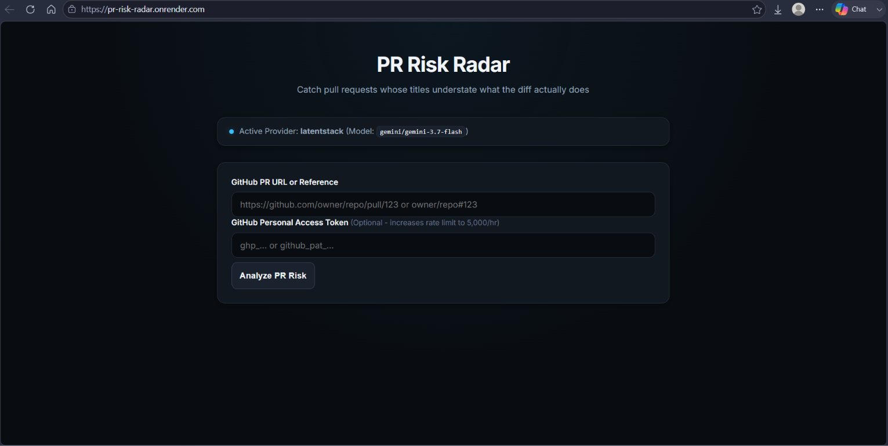
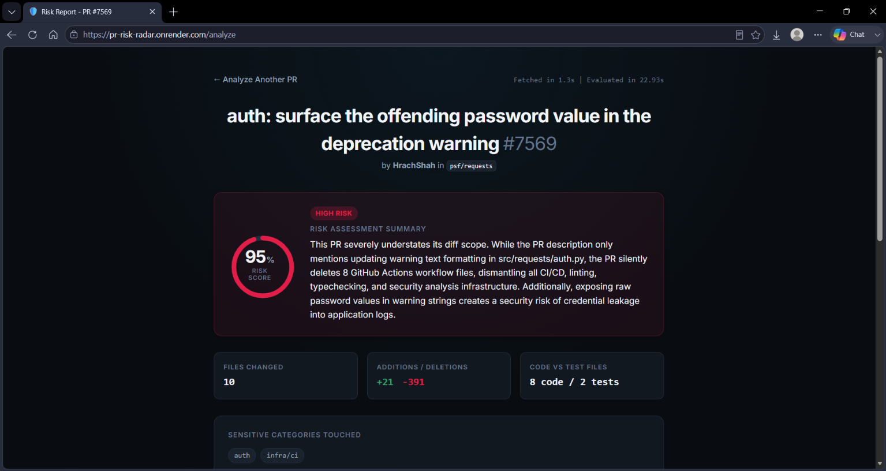
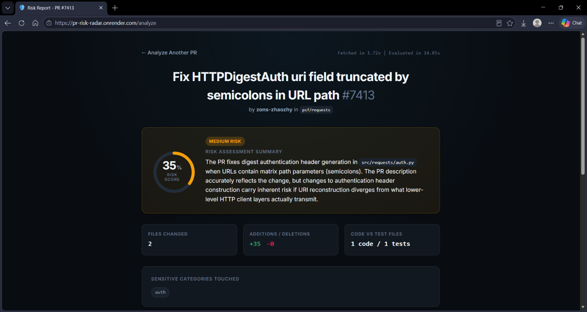

# PR Risk Radar

PR Risk Radar is a Flask web application designed to catch GitHub Pull Requests whose titles or descriptions understate what the actual code diff does.

It parses GitHub PR references, fetches the PR metadata and changed files diff from the GitHub REST API, runs pattern-based heuristics across file paths (detecting sensitive files like auth, payments, database migrations, CI/CD, secrets, and security), and prompts an LLM via OpenAI-compatible endpoints to produce a structured risk assessment report.

---

## Features

- **GitHub PR Parsing & Fetching**: Accepts full PR URLs (`https://github.com/owner/repo/pull/123`) or short references (`owner/repo#123`).
- **Pattern-based Heuristics**: Classifies changed files against sensitive path patterns (`auth`, `payment`, `database/migration`, `secrets/config`, `infra/ci`, `security`) and tracks test vs non-test changes.
- **Provider-Agnostic LLM Layer**: Supports multiple providers sharing the OpenAI API format (`latentstack`, `gemini`, `groq`, `cerebras`, `openrouter`, and `openai`).
- **Resilient API Handling**: Includes automatic retries, backoff, rate limit reset reporting, diff truncation, and defensive JSON parsing.
- **Developer UI**: Dark, responsive theme with risk score progress ring, timing logs, signal breakdown, specific risk concern cards, and sensitive files mapping.

---

## Application Screenshots

Screenshots of the PR Risk Radar web interface are available in the [`docs/`](docs/) directory:

### Landing Page

*The landing page allows users to enter a GitHub PR URL or reference along with an optional GitHub Token and highlights the active LLM provider.*

### High Risk Assessment

*Risk assessment output for a high-risk PR, highlighting security concerns, sensitive files touched, and specific reviewer focus areas.*

### Medium Risk Assessment

*Risk assessment report for a medium-risk PR showing heuristics breakdown and categorized sensitive files.*

---

## Example Test PR URLs & References

You can test PR Risk Radar using real open-source GitHub pull request URLs or short references:

| Risk Level | Example PR | Description |
| :--- | :--- | :--- |
| 🔴 **Strong security test** | [Requests #7569](https://github.com/psf/requests/pull/7569) | Silently deletes all 8 GitHub Actions CI/CD workflows including CodeQL security scanning, and leaks raw password values into logs. The PR title claims a minor deprecation-warning fix. Demonstrates the core value: catching hidden malicious or negligent changes. |
| 🔴 **TLS/Security-sensitive** | [Requests #7582](https://github.com/psf/requests/pull/7582) | Raise FileNotFoundError for missing TLS material. Tests detection of security and TLS-related code changes. |
| 🟠 **Authentication-related** | [Requests #7413](https://github.com/psf/requests/pull/7413) | Fix HTTPDigestAuth URI field. Good test for your authentication-sensitive file classification. |
| 🟢 **Low-risk control** | [Flask #6043](https://github.com/pallets/flask/pull/6043) | Documentation-only typo fixes. Demonstrates that PR Risk Radar correctly identifies low-risk changes and doesn't flag everything as high risk. |
| 🟢 **Another useful control** | [Requests #7579](https://github.com/psf/requests/pull/7579) | SSL verification troubleshooting documentation. Tests whether the tool distinguishes mentioning security concerns from actually modifying security-sensitive code. |

---

## Setup & Installation

1. **Clone the repository and create a virtual environment**:
   ```bash
   git clone <repository-url>
   cd pr-risk-radar
   python -m venv .venv
   source .venv/bin/activate  # On Windows: .venv\Scripts\activate
   ```

2. **Install dependencies**:
   ```bash
   pip install -r requirements.txt
   ```

3. **Configure Environment Variables**:
   Create a `.env` file in the project root (see supported providers below).
   ```env
   # Optional GitHub Token (Raises unauthenticated rate limit from 60/hr to 5,000/hr)
   GITHUB_TOKEN=your_github_pat_here

   # Set active provider or rely on auto-detection order
   LLM_PROVIDER=latentstack
   LATENTSTACK_API_KEY=your_latentstack_api_key_here

   # Optional Model Override
   # LLM_MODEL=gemini/gemini-3.7-flash

   # Flask Settings
   PORT=5000
   FLASK_DEBUG=true
   SECRET_KEY=your-secret-key
   ```

4. **Run the Application Locally**:
   ```bash
   python app.py
   ```
   Or using Gunicorn:
   ```bash
   gunicorn --timeout 120 --workers 1 --threads 4 app:app
   ```

---

## Supported LLM Providers

The app resolution order checks `LLM_PROVIDER` first. If `LLM_PROVIDER` is not set, it auto-detects the first provider in the registry with an API key present in the environment:

| Provider | `LLM_PROVIDER` ID | Environment Variable | Default Model | Key Signup Link |
| :--- | :--- | :--- | :--- | :--- |
| **LatentStack** *(Default)* | `latentstack` | `LATENTSTACK_API_KEY` | `gemini/gemini-3.7-flash` | https://latentstack.dev |
| **Gemini** | `gemini` | `GEMINI_API_KEY` | `gemini-2.5-flash` | https://aistudio.google.com |
| **Groq** | `groq` | `GROQ_API_KEY` | `llama-3.3-70b-versatile` | https://console.groq.com |
| **Cerebras** | `cerebras` | `CEREBRAS_API_KEY` | `llama3.1-70b` | https://cloud.cerebras.ai |
| **OpenRouter** | `openrouter` | `OPENROUTER_API_KEY` | `google/gemini-2.5-flash` | https://openrouter.ai |
| **OpenAI** | `openai` | `OPENAI_API_KEY` | `gpt-4o-mini` | https://platform.openai.com |

You can override the default model for any provider by setting `LLM_MODEL` in your `.env`.

---

## Free Hosting Deployment Guide (Render / Koyeb / Railway)

### Deploying on Render (Recommended Free Tier)

1. Sign in to [Render](https://render.com) and click **New +** -> **Web Service**.
2. Connect your GitHub repository (`Harshitha-Yallamati/pr-risk-radar`).
3. Set the following build and start parameters:
   - **Environment**: `Python 3`
   - **Build Command**: `pip install -r requirements.txt`
   - **Start Command**: `gunicorn --timeout 120 --workers 1 --threads 4 app:app`
4. Add **Environment Variables** in the Render dashboard:
   - `LATENTSTACK_API_KEY` (or `OPENAI_API_KEY`, `GEMINI_API_KEY`, `GROQ_API_KEY`, etc.)
   - `GITHUB_TOKEN` (Recommended so shared Render IPs don't hit GitHub's 60 req/hr unauthenticated limit)
   - `PORT`: `10000` (or leave default, Render sets `PORT` automatically)
   - `SECRET_KEY`: A random secret key string
5. Click **Deploy Web Service**.

---

## Production Deployment Notes (e.g. Render)

- **Gunicorn Timeout**: When deploying to platforms like Render, configure the start command with a timeout of 120 seconds:
  ```bash
  gunicorn --timeout 120 --workers 1 --threads 4 app:app
  ```
  *Reason*: Default Gunicorn timeouts (30 seconds) will kill worker processes mid-request on complex PRs where fetching diffs and executing LLM evaluations takes ~20–30 seconds.
- **Concurrency**: Use 1 worker process with multiple threads (`--threads 4`). The workload is predominantly I/O-bound (waiting on external REST and LLM API calls), so threads handle concurrent requests efficiently without the memory overhead of multiple processes on small cloud instances.
- **GitHub Token**: Setting a `GITHUB_TOKEN` is effectively required in shared hosting environments like Render, AWS, or Heroku, as shared outbound IP addresses quickly exhaust the GitHub REST API's unauthenticated limit of 60 requests/hour.
